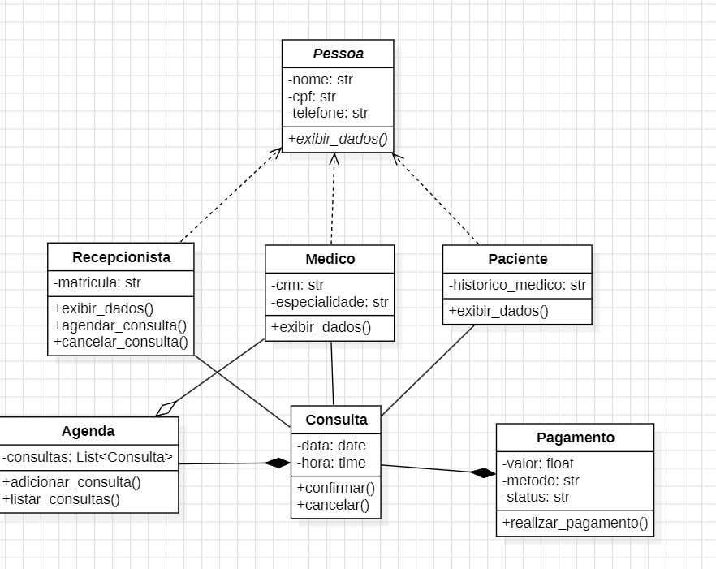
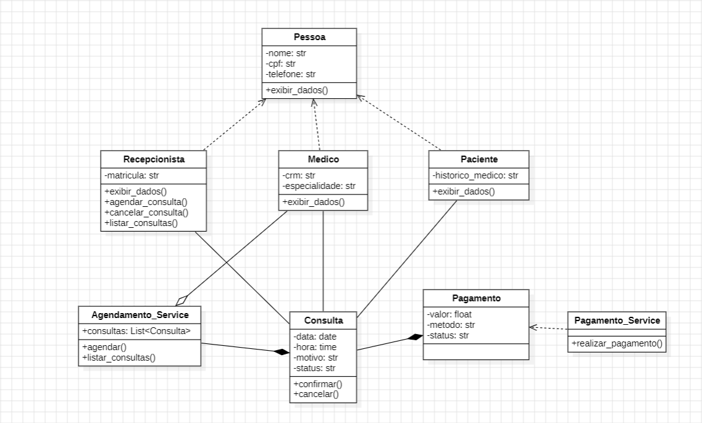
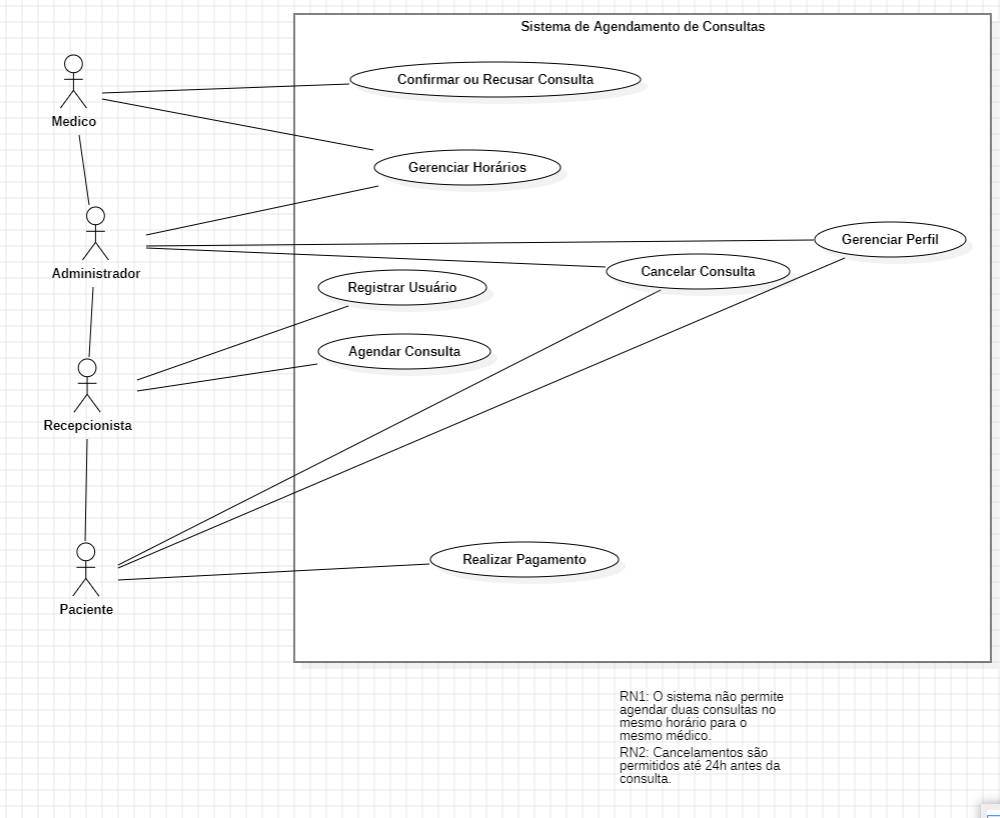

# Sistema de Agendamento

Um sistema simples e modular para gerenciamento de agendamentos, pacientes, médicos e pagamentos.
O projeto segue uma arquitetura organizada em Modelos, Serviços e Testes, facilitando manutenção, escalabilidade e testes unitários.

## Estrutura do Projeto
SistemaAgendamento_codigo/
│
├── Interfaces/                 # Classes de Interface
│   ├── __init__.py
│   ├── agendamento_interface.py
│   ├── cadastro_interface.py
│   ├── cancelamento_interface.py
│   ├── exibir_dados_interface.py
│   ├── main_interface.py
│   ├── pagamento_interface.py
│   ├── run_interface.py
│
├── Modelos/                 # Classes de domínio
│   ├── agendamento.py
│   ├── agenda.py
│   ├── consulta.py
│   ├── medico.py
│   ├── paciente.py
│   ├── pagamento.py
│   ├── pessoa.py
│   ├── recepcionista.py
│
│
├── Servicos/               # Regras de negócio
│   ├── agendamento_service.py
│   └── pagamento_service.py
│
├── Testes/                 # Testes unitários
│   ├── test_agendamento.py
│   └── test_pagamento.py
│
├── README.md               # (Este arquivo)
└── requirements.txt        # Dependências

## Diagrama de Classes Inicial

## Diagrama de Classes Final

## Diagrama de Casos de Uso

## Funcionalidades
Cadastro de pacientes e médicos
Criação e gerenciamento de agendamentos
Vinculação de consultas com horários
Processamento básico de pagamentos
Camada de serviços separada
Testes automatizados

## Tecnologias Utilizadas
Python 3.11+
Arquitetura orientada a objetos
Testes com pytest

## Instalação
Clone o repositório:
git clone https://github.com/arthurlorenzett/ProjetoPOO.git
cd SistemaAgendamento

## Instale as dependências:
pip install -r requirements.txt

## Como Executar
Execute o arquivo principal:
py -m Interfaces.run_interface

## Rodando os Testes
Use o pytest:
pytest -v

## Estrutura de Classes
Modelos
Pessoa – Classe base para Paciente e Médico
Paciente
Médico
Recepcionista
Agendamento
Agenda
Consulta
Pagamento
Serviços
AgendamentoService – Responsável por criar e organizar agendamentos
PagamentoService – Realiza validação e registro de pagamentos

## Melhorias Futuras
Persistência de dados (SQLite ou PostgreSQL)
API REST (FastAPI ou Flask)
Sistema de notificações